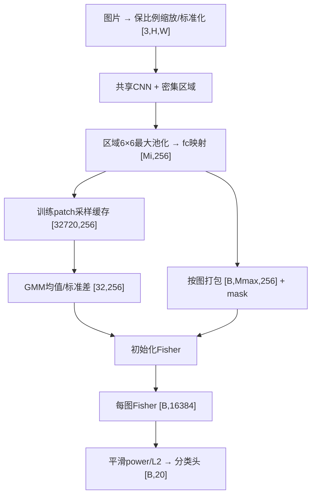

# 主干二：局部特征与GMM初始化（原步骤5–8）

## 目标与关键实现

把整图CNN改为共享卷积的局部特征分支，生成真实训练描述子，再初始化Fisher Layer。沿用主干一的环境、默认模型包和VOC2012数据；**本阶段不训练CNN/分类器，步骤8进行无监督GMM拟合。**

| 步骤 | 实现目标 | 核心结果 |
|---|---|---|
| 5：SPP | 移除最后max-pool；每个区域6×6最大池化，fc映射到256维 | 手算池化、实图前向、梯度和CPU/GPU检查通过 |
| 6：密集区域与接口 | 最长边480保比例缩放；七尺度区域；按图打包和mask | 两图721/413个patch，`[2,721,256]→[2,16384]`，分块及mask验证通过 |
| 7：描述子采样 | train抽256张，每图最多128条，固定seed=42 | 缓存`[32720,256]`；无非有限值、近恒定维度或零范数行 |
| 8：GMM与初始化 | 32成分对角GMM；均值/标准差初始化Fisher | 60次EM迭代收敛；无空分量；NumPy简化编码误差约7.8e-16 |

## 必须保留的接口约定

- 区域边长64/96/128/160/192/224/256、步长32；只取完整落在图内的区域，不补边界区域；投影重复暂保留。
- 图片保持宽高比、分别卷积，不先补齐像素。区域坐标是缩放图像上的包含右下端点的xyxy；stride16取整裁边是当前工程约定。
- 每图局部特征`[Mi,256]`；打包后`[B,Mmax,256]`和布尔mask`[B,Mmax]`。Fisher忽略padding，输出`[B,16384]`。
- GMM使用原始256维train描述子，不额外PCA或L2；256张图抽样不代表所有patch等概率，也不保证类别平衡。
- GMM配置：float64、kmeans初始化、seed42、n_init1、max_iter100、tol1e-3、reg_covar1e-6；实际方差范围0.02483–6.99526。
- 初始化必须传**标准差**：`w=1/stds, b=-means`。传统GMM后验与简化Fisher后验分别验证，不要求二者相等。

## 主数据流程（截至当前）



缓存的每行是一个patch，Fisher输出的每行是一张图片。正式图像编码使用完整区域集合，不默认套用GMM采样的每图128条上限。

## 入口、产物与复现

| 入口/模块 | 职责 |
|---|---|
| `step05_verify.py`、`step06_verify.py` | SPP、密集网格、打包和完整特征接口验证 |
| `step07_verify.py`、`step07_sample.py` | 采样测试、生成缓存和统计 |
| `step08_gmm.py` | GMM拟合、初始化与实图梯度验证 |
| `data/patch_inputs.py` | 比例缩放、网格、变长图片列表 |
| `models/spp_patch_encoder.py`、`models/dense_fisher_encoder.py`、`models/fisher_layer.py` | 区域描述子、按图聚合、Fisher编码 |

关键运行目录（均在项目`runs/`）：

- 接口：`step06_dense_20260919_211033/`。
- 缓存：`step07_sample_20260920_012954_361930/`；`descriptors.npz`保存描述子、图片归属、区域坐标、网格行号、偏移表和ID。
- 初始化：`step08_gmm_20260920_014414_978178/`；`gmm.npz`保存均值/方差/标准差/权重，`fisher_init.pt`仅保存Fisher层参数。

```powershell
python step06_verify.py
python step07_verify.py
python step07_sample.py --images 256 --per-image 128 --seed 42 --device cuda
python step08_gmm.py --source runs/step07_sample_20260920_012954_361930
```

上述最后一条复用既有缓存；若使用新采样，应将source改为新运行目录。正式加载推荐`FisherClassifier.from_gmm`，它校验来源并设置初始化状态。

## 仍需对齐

尚未完全核对原Caffe坐标边界；仅一个图像最长边尺度480；极窄图缩放后短边不足64会报错。GMM只有256图、单种子试验；数值收敛不代表分类能力提高。下一主干是[联合训练](03_joint_training.md)。
