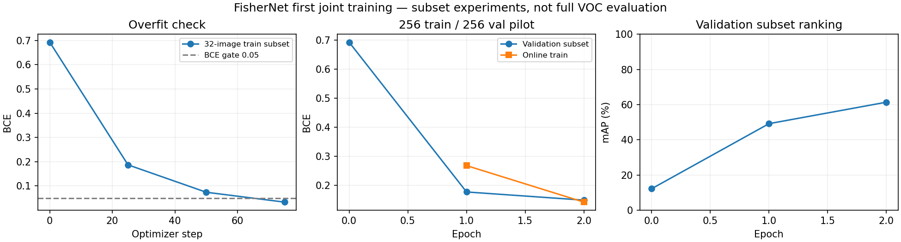
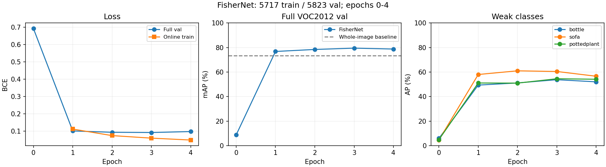
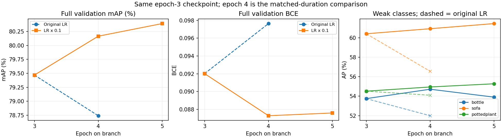
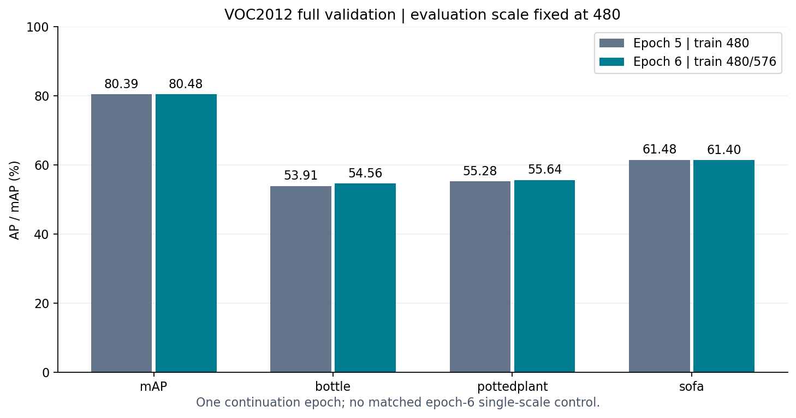
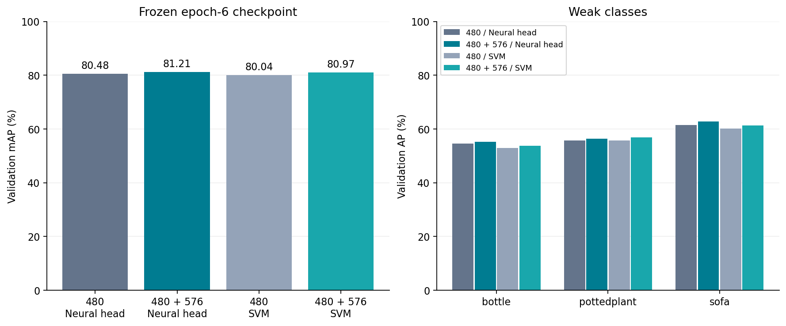
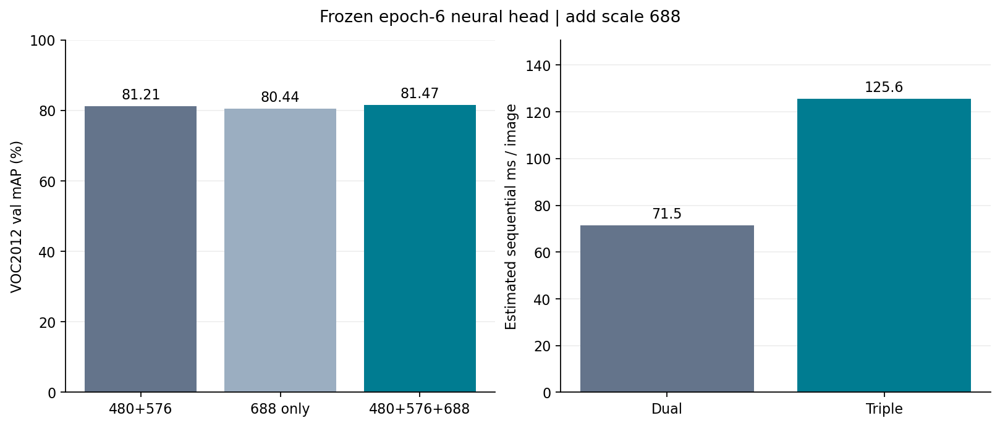
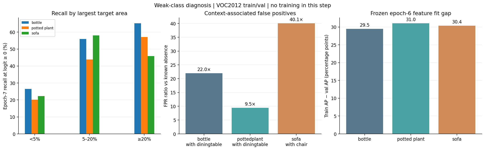

# 主干三：联合训练与下一步（原步骤9）

## 当前状态

已从第6轮推进一轮至第7轮，学习率减半。固定480/576/688三尺度评估达到81.4932% mAP，比第6轮仅高0.019个百分点；三项重点弱类AP与验证BCE均未改善。后续只读诊断确认该增益的配对重采样区间包含0，三个弱类train–val AP差距约29–31个百分点。第7轮保留为数值最佳，第6轮作为下一项正则化单变量实验的共同起点；接口已通过零更新核验，训练尚未开始。

## 模型与训练约定

`CNN → SPP局部特征 → Fisher [B,16384] → 平滑power/L2 → Linear(16384,20)`。

power采用`x/sqrt(abs(x)+1e-6)`，保证零点梯度有限；是工程近似，不是精确signed-sqrt。使用有效标签平均BCE，忽略raw_label=0；输出是20类独立logits。归一化、梯度及标签屏蔽测试通过。

## 关键结果

| 实验 | 配置 | 结论 |
|---|---|---|
| 32图拟合验收 | batch2，关闭dropout/增强；Adam LR：CNN3e-5、Fisher1e-3、head1e-2 | 75步达到BCE0.03303、F1和正类召回100%，通过预设门槛 |
| 256 train / 256 val试训 | batch2，dropout+水平翻转；Adam LR：CNN1e-5、Fisher3e-4、head3e-3 | 2轮、256次更新；验证子集mAP61.36%，checkpoint重载输出一致 |

两实验最长边480、完整区域网格、梯度裁剪10；试训从原CNN基线+GMM+随机头重新初始化，不沿用32图过拟合权重。

| 轮次 | 在线train BCE | val BCE | 子集val mAP | micro-F1 | 正类召回 |
|---|---:|---:|---:|---:|---:|
| 0 | — | 0.69296 | 12.15% | 13.04% | 48.03% |
| 1 | 0.26846 | 0.17775 | 49.15% | 36.21% | 22.57% |
| 2 | 0.14278 | 0.14961 | 61.36% | 55.05% | 39.37% |

瓶子/沙发/盆栽子集AP：29.63%/27.75%/17.37%。小样本验收耗时27.76秒、峰值显存1355MiB；试训92.19秒、峰值1661MiB。



## 如何解释结果

- 拟合验收证明整条链路能学习；子集val不参与梯度，但此前完整val已用于整图基线选模，不是独立test。
- train/val子集先覆盖20类再固定种子补齐，不代表完整数据分布。**61.36%不能直接与整图完整val的73.39%比较。**
- 在线train BCE与轮末eval BCE条件不同；只训练两轮，不宣称收敛。当前Adam、平滑power、单图尺度和最终分类协议尚未完全对齐论文。

## 入口与保存位置

- `models/fisher_classifier.py`：GMM来源校验、归一化和分类头。
- `step09_verify.py`：接口测试；`step09_train.py`：32图拟合验收；`step09_pilot.py`：train/val联合训练、checkpoint和epoch边界续训。
- 拟合记录：`runs/step09_overfit_20260920_172016/`。
- 试训记录：`runs/step09_pilot_20260920_172330/`，含config、样本ID、history、result、best/last权重与最佳预测；完整逐类AP查看result/history。

```powershell
python step09_verify.py
python step09_train.py
python step09_pilot.py --train-images 256 --val-images 256 --epochs 2
```

## 完整数据联合训练：第1–4轮（更新2026-09-21）

### 连续训练关系

第1–2轮从固定CNN基线、第八步GMM和随机分类头开始。第3–4轮通过`--resume`读取第2轮last.pt，恢复网络、Adam状态、NumPy/Torch/CUDA随机状态和相同样本ID；不重新初始化Fisher或分类头。

重算第2轮完整val mAP与原记录相差0.000e+00（比例值），验证了本次续训起点；不等于证明跨进程逐步优化轨迹完全一致。

### 保持不变的设置

Windows、dinov3_pspnet、RTX4060 Laptop；train5717 / val5823，batch2；最长边480保比例缩放、七尺寸密集patch、区域分块64；翻转与fc dropout。Adam学习率CNN1e-5/Fisher3e-4/head3e-3，梯度裁剪10，无额外weight decay，平均有效标签BCE。此次未修改结构、采样、损失或学习率。

全量图片解码/尺寸检查已在`runs/full_training_preflight_20260920.json`完成。本次沿用相同数据，未重复扫描或重新拟合GMM。

### 完整val逐轮结果

| 总轮次 | 在线train BCE | val BCE | val mAP % | micro-F1 % | 正类召回 % |
|---|---:|---:|---:|---:|---:|
|0|—|0.69299|8.74|12.46|47.99|
|1|0.11187|0.10115|76.76|73.84|68.93|
|2|0.07428|0.09346|78.40|75.74|70.40|
|3|0.05964|0.09202|79.47|76.51|70.93|
|4|0.04865|0.09764|78.74|76.19|72.24|

历史最佳为第3轮，完整val mAP **79.47%**。第4轮相对第2轮变化+0.34个百分点。整图默认基线同一val为73.39%，当前历史最佳相比提高6.08个百分点，但两套流程不是单因素对照。

| 弱类别 | 第1轮AP % | 第2轮AP % | 第3轮AP % | 第4轮AP % |
|---|---:|---:|---:|---:|
|bottle|49.34|51.10|53.75|51.99|
|sofa|57.98|60.98|60.43|56.57|
|pottedplant|51.06|50.96|54.52|54.10|

本次新增5718次更新，完整训练累计11436次；续训耗时21.14分钟，峰值已分配显存1880.30MiB。包含恢复起点验证与轮末评估。最后检查点重载后同图logits完全一致。

在线训练BCE含增强/dropout并随参数变化；val BCE是轮末eval结果，二者不能直接相减判定泛化。val一直用于选模，非独立test。



### 检查点与证据

- 第1–2轮：`runs/step10_full_20260920_181950/`。
- 第3–4轮：`runs/step10_full_20260920_234434/`；config记录resume来源，history保留恢复起点和新增轮次；result记录本次结果。
- **原学习率阶段最佳权重**：`runs/step10_full_20260920_234434/best.pt`（第3轮）。
- **当前训练末状态**：`runs/step10_full_20260920_234434/last.pt`（第4轮）；完整保留，但不等同于最佳。
- 原始预测、样本ID、逐类AP、优化器/随机状态继续保留；运行详情在`report/archive/run_details/step10_full_20260920_234434.md`。

本轮实际执行：

```powershell
conda activate dinov3_pspnet
python step09_pilot.py --train-images 0 --val-images 0 --resume runs/step10_full_20260920_181950/last.pt --epochs 4
```

`--epochs 4`表示目标总轮数4，实际新增第3/4轮。续训沿用checkpoint样本与配置，不会把子集自动扩大为全量。

### 下一步判断

第4轮训练BCE继续下降，但相对第3轮验证BCE上升、mAP回落，提示泛化收益开始波动；这不足以单独证明过拟合或归因于某个模块。保留第3轮best，下一阶段优先从该点进行降低学习率的短程分支对照，而不是继续相同学习率；此建议已在下节低学习率分支执行，接口现已支持--lr-scale。 继续观察弱类和逐类回退，保留历史best；不要将last自动等同于best。不同时引入多尺度/新backbone/损失加权。

当前仍保留Adam、平滑power、单图尺度480和256图GMM初始化等工程设置；论文优化日程、区域边界、多尺度和最终SVM协议仍待后续对齐。

## 第3轮最佳点出发的低学习率对照（2026-09-21）

### 实验设计与公平比较范围

从原学习率阶段第3轮`best.pt`恢复全部网络、Adam动量/计数、随机状态和完整train/val ID。所有设置不变，**仅将恢复后的三组学习率乘0.1**：CNN1e-6、Fisher3e-5、head3e-4。新增两轮，对应本分支第4/5轮。

原学习率第4轮也是从同一第3轮状态继续，因此它与低学习率分支第4轮具有相同起点、优化器状态、样本ID及恢复的随机状态，可以作为相同时长对照。没有重跑原LR第4轮，也没有原LR第5轮对照；分支第5轮仅说明低LR进一步训练的表现。不宣称跨GPU算法逐比特确定性或统计显著性。

新增`--lr-scale`在恢复优化器后应用一次，默认1保留原学习率；不会清空Adam动量或计数。已检查倍率、默认恒等、动量不变及非法输入拒绝。配置记录实际LR、缩放事件和起点文件SHA256。**以后继续低LR分支时不应再次误传0.1，否则会再缩小一次。**

### 完整VOC2012 val结果

| 条件 | 在线train BCE | val BCE | val mAP % | micro-F1 % | 正类召回 % |
|---|---:|---:|---:|---:|---:|
|共同起点：第3轮|0.05964|0.09202|79.47|76.51|70.93|
|原LR：第4轮|0.04865|0.09764|78.74|76.19|72.24|
|低LR：分支第4轮|0.03959|0.08729|80.17|77.88|72.85|
|低LR：分支第5轮|0.03570|0.08759|80.39|78.08|73.96|

低LR分支第4轮相对原LR第4轮mAP变化 **+1.43个百分点**。当前最佳为低LR分支第5轮，完整val mAP **80.39%**；相对共同起点变化+0.92个百分点。

| 类别 | 共同起点第3轮 | 原LR第4轮 | 低LR第4轮 | 低LR第5轮 |
|---|---:|---:|---:|---:|
|bottle|53.75|51.99|54.72|53.91|
|sofa|60.43|56.57|60.95|61.48|
|pottedplant|54.52|54.10|54.95|55.28|

以上均为AP%。相同时长的第4轮比较中，低学习率mAP更高且val BCE更低，支持本次降学习率的决定。 分支第5轮mAP再增0.23个百分点，但val BCE略回升，瓶子AP回落；收益已放缓。保留第5轮整体mAP最佳，同时保留第4轮指标用于观察校准/弱类差异，暂不据两轮结论宣称收敛或继续加大训练预算。



### 成本、产物与检查

新增5718次优化更新，耗时20.70分钟，峰值已分配显存1880.30MiB；起点完整val指标与原第3轮一致，最后checkpoint重载输出一致。

- 当时推荐权重：`runs/step11_lrbranch_20260921_002230/best.pt`（低LR分支第5轮）。
- 本次末状态：`runs/step11_lrbranch_20260921_002230/last.pt`，包含优化器与随机状态。
- 本次原始目录：`runs/step11_lrbranch_20260921_002230/`，config/history/result、best预测、样本ID及`lr_comparison.json`。
- 原学习率对照：`runs/step10_full_20260920_234434/history.json`第4轮，旧文件保留。

本次实际命令：

```powershell
python step09_pilot.py --train-images 0 --val-images 0 --resume runs/step10_full_20260920_234434/best.pt --lr-scale 0.1 --epochs 5
```

5为分支目标总轮数，不是新增5轮。未改变结构、数据增强、batch2、密集patch、GMM来源或损失。仍使用train5717/val5823；val用于选模，不是独立test。

### 当时的下一步（已推进）

优先根据低LR分支的趋势与逐类变化确定有限续训预算，避免立即同时改尺度、GMM或损失。即使分数提高，也只支持当前单种子/当前起点的短程结论；完整复现的边界/日程/多尺度/SVM差异依然存在。

## 双尺度训练一轮与论文复核（2026-09-21）

**本轮完成第6轮全量训练，val mAP 80.48%，相比起点+0.09个百分点；当前推荐最佳为80.48%。**

### 改动依据与配置

第5轮预测结合XML尺寸诊断：瓶子、盆栽漏检图像中最大有效目标面积占比中位数分别为2.11%、4.96%，命中图像分别为9.37%、14.26%。小于5%面积的正样本召回仅23.53%、25.25%。这是尺寸相关性，不证明因果；沙发不呈现同样现象。框仅用于验证集错误诊断，训练仍只使用图像级标签。原始统计：`runs/step12_scale_diagnostic.json`。

从低LR分支第5轮best恢复模型、Adam状态和随机状态，仅引入每图随机最长边480/576；验证固定480，保留水平翻转、batch2和全部密集patch。CNN/Fisher/head学习率继续为1e-6/3e-5/3e-4。训练5717张、验证5823张；仅新增1轮、2859次更新。实际尺度计数：{'480': 2884, '576': 2833}。独立尺度随机数不占用原有样本顺序/翻转随机序列；dropout仍会受输入形状影响。

### 结果

| 指标（%） | 第5轮起点 | 第6轮双尺度 | 变化（百分点） |
|---|---:|---:|---:|
| 整体mAP | 80.39 | 80.48 | +0.09 |
| bottle | 53.91 | 54.56 | +0.65 |
| pottedplant | 55.28 | 55.64 | +0.36 |
| sofa | 61.48 | 61.40 | -0.08 |

val BCE：0.08759 → 0.08894；在线train BCE 0.03671；micro-F1 78.03%，正类召回74.79%（logit≥0）。输入分布已变，在线训练损失不能当作与上一轮严格同条件的收敛比较。mAP仅小幅上涨且验证BCE变差，不能判断全面改善或已稳定收敛。

固定logit≥0时，小目标瓶子召回23.53% → 32.84%（204张），小目标盆栽25.25% → 26.26%（99张）；小目标沙发保持33.33%（仅9张）。这里按同类最大非difficult框不足图像面积5%分组；结果支持瓶子漏检有所减少，但召回不等于AP，也不证明尺度增强的独立因果效果。计数与检查见`verification.json`。

耗时16.01分钟（含起点复测及末次验证），峰值已分配显存1880MiB。混合尺寸前向/反向、有限值检查通过；完整checkpoint重载输出逐值一致。保存预测的mAP另行重算，检查点保留优化器状态。

候选整体mAP提高，保留为当前推荐最佳。 这是一次续训观察，没有同起点、同轮次的单尺度对照，也没有多种子，不能将全部变化归因于尺度增强。



### 与原论文对照

| 实验 | 数据协议 | mAP % |
|---|---|---:|
| 本地整图AlexNet默认基线 | VOC2012 train → val | 73.39 |
| 本地整图320候选 | VOC2012 train → val | 75.00 |
| 本地FisherNet当前最佳 | VOC2012 train → val，480验证 | 80.48 |
| 论文FisherNet-AlexNet | VOC2012 trainval → test | 83.0 |
| 论文FisherNet-AlexNet | VOC2007 trainval → test | 83.4 |
| 论文FisherNet-VGG16 | VOC2012 / VOC2007 test | 91.5 / 91.7 |

来源：[原论文Table 1–3与§4.1](https://arxiv.org/html/1608.00182)。纠正早期对话：91.5%对应VOC2012，VOC2007为91.7%。不同划分、训练量和backbone的数字只作参照，不计算“复现达成率”。本地相比默认整图基线提高7.09个百分点，但不是单因素消融。

| 项目 | 原论文 | 当前实现 / 下一步 |
|---|---|---|
| 主干表示 | AlexNet；D256、K32、FV16384 | 已建立可微CNN→SPP→Fisher链路 |
| 图像尺度 | 480/576/688/864/1200；最终多尺度表示平均 | 训练480/576，验证480；优先固定权重比较多尺度评估 |
| 最终分类 | one-vs-all线性SVM，C=1 | BCE线性头；后续缓存train/val表示，补SVM比较 |
| 优化协议 | 40000步，momentum0.9、weight decay0.0005 | 当前分支累计17154步Adam；另立论文日程对照，不能直接复制学习率 |
| 实现细节 | Caffe流程 | 区域投影、平滑power为工程约定；仍需逐项核对 |
| 结果协议 | trainval训练、test评价 | val反复选模；冻结方案后再做正式test评价 |

**阶段结论：结构与训练流程已初步复现，论文原协议的结果复现尚未完成。** 下一步先固定最佳权重，评估单尺度/双尺度表示与SVM的收益；若继续检验训练尺度贡献，应增加第5轮起点的单尺度第6轮对照。弱类变化、整体mAP和开销共同决定是否保留方案，避免只挑单类上涨。

### 复现与证据

```powershell
python step09_pilot.py --train-images 0 --val-images 0 --epochs 6 --resume runs/step11_lrbranch_20260921_002230/best.pt --train-scales 480 576
```

6是目标总轮数，只新增第6轮。原始目录：`runs/step12_scale_20260921_130318/`；包含配置、ID、history/result、逐图尺度分配、last预测与权重、comparison。推荐权重：`runs/step12_scale_20260921_130318/best.pt`。逐次详情归档在`report/archive/run_details/step12_scale_20260921_130318.md`。

## 固定权重：尺度与SVM对照（2026-09-21）

**本步未继续训练CNN/Fisher/原分类头；仅拟合两组各20个线性SVM。当前四组最佳为 `mean480_576_neural`，完整VOC2012 val mAP 81.21%。**

### 目标和固定条件

固定第6轮`runs/step12_scale_20260921_130318/best.pt`。沿用Windows、dinov3_pspnet、RTX4060 Laptop；float32推理，eval模式、无翻转，TF32关闭。train5717张只用于拟合SVM；val5823张仅评估/比较，二者ID无交叉。SVM按类别忽略raw_label=0，-1/+1作为负/正标签，不利用验证标签拟合或调C。

`step13_evaluate.py`新增职责：提取两尺度FV并保存缓存 → 分别用原分类头、SVM评分 → 完整val比较。每尺度先沿用平滑power/L2，再将480和576表示等权平均；平均后不再次归一化。这样双尺度原分类头等价于两个尺度的logit平均，不是概率平均。所有对照保持相同的归一化约定，避免同时混入归一化变化。

### 四组结果

| 配置 | val mAP % | bottle AP % | pottedplant AP % | sofa AP % |
|---|---:|---:|---:|---:|
| single480_neural | 80.48 | 54.56 | 55.64 | 61.40 |
| single480_svm | 80.04 | 52.84 | 55.73 | 60.21 |
| mean480_576_neural | 81.21 | 55.25 | 56.33 | 62.86 |
| mean480_576_svm | 80.97 | 53.71 | 56.80 | 61.25 |

同一480特征改用SVM：-0.45个百分点；原分类头加入双尺度：+0.73个百分点；SVM由单尺度改为双尺度：+0.93个百分点。数字均为同一checkpoint和同一验证集上的比较，不能外推至未见过的test。



### SVM训练与验证

固定C=1，L2惩罚、squared-hinge、dual=True、tol=1e-4、max_iter=10000、intercept=True、intercept_scaling=1、随机种子42，无类别重权重。使用sklearn LinearSVC/LIBLINEAR；这是明确的工程求解器配置，论文未列出的solver/bias细节不宣称完全对齐。未做C搜索。收敛警告作为失败处理。

| 配置 | 拟合train mAP % | 20类最大迭代数 | 拟合耗时秒 |
|---|---:|---:|---:|
| single480_svm | 99.54 | 45 | 95.5 |
| mean480_576_svm | 99.28 | 45 | 99.2 |

train成绩只说明训练集拟合，不能代替val。SVM输出为决策分数，不是概率，不与BCE数值直接比较。总耗时16.26分钟，四份float32缓存合计约1.41GiB。每份缓存记录SHA256、尺寸和提取耗时，只有完成标记且校验一致才复用。

验证通过：缓存与分类头直接输出一致；单尺度原头复现80.48%起点，最大logit误差1.1e-05；checkpoint哈希未变；四组保存预测重算AP一致；SVM权重读回、重新评分一致；特征有限且逐尺度L2范数有效。详见`verification.json`。本步神经网络参数更新数为0。

### 当前结论与论文边界

推荐的完整推理组合为`mean480_576_neural`，不能只拿神经网络checkpoint而忽略对应尺度和分类器。具体组合写入`recommended_pipeline.json`；原神经网络最佳仍是第6轮。此比较使用已反复选模的val，只能支持当前本地方案选择。

原论文最终采用五尺度表示和one-vs-all线性SVM（C=1），AlexNet的VOC2012 test mAP为83.0%。本步补上了SVM和双尺度评估，但仍缺688/864/1200三个尺度；平滑power、尺度融合/归一化顺序、求解器细节、训练日程及train→val划分仍有差异。因此仍是逐步复现，不能把本地val与论文test直接排名。[论文§4.1与Table 2](https://arxiv.org/html/1608.00182)

下一步优先根据本表确定分类器，再单独加入更大尺度评估，并记录显存/时间收益；不因某次val上涨就立即改动训练。当前SVM在单/双尺度下均低于对应原分类头，因此保留双尺度原分类头作为推荐，SVM作为已完成的论文协议对照。正式结果复现需先冻结完整方案，再按原划分评估；不能将本次val作为最终独立检验。

### 数据路径与复现命令

```text
第6轮最佳checkpoint（冻结）
  → train / val图像分别缩放480和576（无翻转）
  → CNN → SPP → Fisher → 平滑power/L2
  → 每尺度[N,16384]缓存
  ├─ 480特征 → 原分类头 / 仅train拟合的20个SVM
  └─ 两尺度均值 → 原分类头 / 仅train拟合的20个SVM
  → val [5823,20]决策分数 → 每类AP及mAP
```

```powershell
python step13_evaluate.py
# 复用当前已完成的特征缓存；仍会重新拟合SVM
python step13_evaluate.py --run runs/step13_eval_20260921_170016
```

原始目录`runs/step13_eval_20260921_170016/`保存config、特征、样本ID/标签、四组预测、两组SVM权重、result/verification、运行源码和推荐组合。单次详情保存在`report/archive/run_details/step13_eval_20260921_170016.md`。报告根目录仍只保留索引和三份主干。

## 增加688尺度：精度与开销（2026-09-21）

**本步未训练神经网络，也未拟合SVM。固定第6轮权重和原分类头，480/576/688三尺度为双/三尺度比较中的精度优先方案，完整val mAP 81.47%。**

| 配置 | val mAP % | bottle AP % | pottedplant AP % | sofa AP % |
|---|---:|---:|---:|---:|
| 480/576双尺度 | 81.21 | 55.25 | 56.33 | 62.86 |
| 688单尺度（诊断） | 80.44 | 54.17 | 54.91 | 62.33 |
| 480/576/688三尺度 | 81.47 | 55.46 | 56.30 | 63.38 |

三尺度相对双尺度变化+0.26个百分点；20类中16类AP上升、4类下降。688单尺度仅作诊断，主对照是向既定480/576组合中加入688。单次固定权重的val比较不代表独立test成绩，也不能证明更大的尺度必然更好。

### 固定配置和验证

Windows / dinov3_pspnet / RTX4060 Laptop；batch2、float32、TF32关闭、eval模式、无翻转。模型来源`runs/step12_scale_20260921_130318/best.pt`；仅评估VOC2012 val5823张。复用经SHA256验证的第13步480/576缓存，新增688缓存`[5823,16384]`。各尺度先平滑power/L2，然后特征等权平均，不再次归一化，最后使用同一个线性头；没有阈值调参。

原双尺度预测逐值复现；688特征有限、L2范数和直接分类接口检查通过；保存后的三组预测重算mAP一致；checkpoint哈希未改变。神经网络更新0次，SVM拟合0次，因此没有新增训练指标或训练损失。

### 开销

相同固定64张val图片，逐尺度预热后重复2次；计时包含读图、缩放、数据传输和推理，CUDA同步。以下为两次耗时的中位数折算，显存是该样本上的峰值已分配量，不是全数据集峰值或整卡占用。

| 尺度 | 毫秒/图 | 已分配峰值MiB |
|---|---:|---:|
| 480 | 31.5 | 422 |
| 576 | 40.0 | 548 |
| 688 | 54.1 | 707 |

顺序执行估算：双尺度71.5ms/图，三尺度125.6ms/图，约1.76倍。该值是各尺度实测相加，不是优化后的整条多尺度流水线实测；少量重复会受缓存、温度和系统负载影响。完整688特征提取5.66分钟，总实验6.26分钟，新缓存约364MiB。



### 结论与下一步

三尺度精度更高，作为精度优先方案；双尺度保留为较快方案。 收益和成本应同时考虑，不能只凭加入一个尺度就宣称完成论文结果复现。当前训练仍只使用过480/576，688在本步仅用于推理；验证集已多次用于选模。

下一步先根据这次收益决定是否扩展864；如继续扩展，仍固定权重和分类头，独立记录新增尺度的边际收益与显存，不同时改变训练策略或SVM参数。

入口`step14_scale688.py`负责校验旧缓存、相同样本计时、提取688、尺度融合和评估；无优化器。实际命令：

```powershell
python step14_scale688.py
```

运行目录`runs/step14_688_20260921_172409/`：配置、计时图片ID、688缓存及SHA、三组预测、result、推荐推理组合、执行源码。精度优先组合见`recommended_pipeline.json`。原始第13步缓存与所有旧权重保留；本次逐次详情在`report/archive/run_details/step14_688_20260921_172409.md`。

## 增加864尺度：收益趋于停滞（2026-09-21）

固定第6轮权重和原分类头，在完整VOC2012 val5823张上新增864尺度。**本步未训练神经网络，也未拟合SVM。**

| 配置 | val mAP % | bottle AP % | pottedplant AP % | sofa AP % |
|---|---:|---:|---:|---:|
| 480/576/688三尺度 | 81.4742 | 55.46 | 56.30 | 63.38 |
| 864单尺度（诊断） | 78.4282 | 53.96 | 53.87 | 59.35 |
| 480/576/688/864四尺度 | 81.4828 | 55.73 | 56.45 | 63.25 |

四尺度仅提高0.0086个百分点，瓶子/盆栽略升、沙发略降；没有充分证据支持稳定泛化收益。单独864成绩降低，说明扩大输入本身不是可靠的改进方向。当前训练只用过480/576，尺度分布差异可能相关，但本实验没有验证其因果作用。

配置沿用Windows、dinov3_pspnet、RTX4060 Laptop，batch2、float32、TF32关闭、eval、无翻转。每尺度先平滑power/L2，再等权平均特征并用原分类头评分，平均后不重新归一化。复用第13/14步的已校验缓存，只新增`[5823,16384]`的864缓存，约364MiB。训练更新0次，因此无新增训练损失。

同一批固定64张图片、各尺度预热后重复2次，包含读图/缩放/传输/推理并同步CUDA：

| 尺度 | 中位耗时折算ms/图 | 样本峰值已分配MiB |
|---|---:|---:|
| 480 | 31.6 | 422 |
| 576 | 40.7 | 548 |
| 688 | 62.0 | 707 |
| 864 | 90.5 | 1082 |

本次顺序耗时估算：三尺度134.4ms/图、四尺度224.9ms/图，约1.67倍。这是各尺度计时相加，不是优化后端到端流水线的实测；短样本会受系统负载影响。完整864提取7.70分钟，总实验8.41分钟，全量提取峰值已分配显存1209MiB（不等于整卡占用）。

检查通过：旧三尺度预测逐值复现；缓存SHA、图片ID和标签一致；新增特征有限且L2范数正确；直接分类接口一致；保存预测重算mAP一致；checkpoint哈希不变。

**实用推荐保留三尺度81.47%，四尺度81.48%仅作为数值最高的实验方案。** 本判断依据本轮结果与开销权衡，非预注册门槛，也没有显著性检验。`recommended_pipeline.json`是脚本按最高mAP自动选择的四尺度；`practical_pipeline.json`是综合成本后保留的三尺度组合。不要将二者混用。

下一步建议先固定三尺度方案，回到训练策略与弱类诊断；若目标是补全论文的尺度集合，再将1200作为独立的协议对照，不预期它必然提升成绩。当前仍为反复选模的val，尚不是原论文test协议的结果复现。

入口`step15_scale864.py`负责缓存校验、等样本计时、864提取、尺度融合和评估，无优化器。复现命令：

```powershell
python step15_scale864.py
```

原始目录：`runs/step15_864_20260921_205024/`，包含配置、执行源码、计时ID、864缓存及SHA、三组预测、result和两种推理组合。旧缓存与权重均保留。本轮详情归档至`report/archive/run_details/step15_864_20260921_205024.md`。

## 第7轮：减半学习率续训与三尺度复评（2026-09-22）

**本步实际训练一轮：5717张train、2859次更新；随后完整评估5823张val。** 依据最近验证BCE上升、mAP增益缩小，本次只将已恢复的学习率乘0.5，保留Adam状态与其他训练条件。单尺度用于延续历史记录；事先指定三尺度整体mAP为最终选模依据，见本次`experiment_plan.json`。

| 指标 | 第6轮 | 第7轮 | 变化 |
|---|---:|---:|---:|
| 单尺度480 val mAP % | 80.4846 | 80.4481 | -0.0365个百分点 |
| 三尺度 val mAP % | 81.4742 | 81.4932 | +0.0190个百分点 |
| 三尺度 bottle AP % | 55.46 | 55.28 | -0.18个百分点 |
| 三尺度 pottedplant AP % | 56.30 | 55.84 | -0.45个百分点 |
| 三尺度 sofa AP % | 63.38 | 63.08 | -0.31个百分点 |
| 在线train BCE | 0.03671 | 0.03433 | 下降 |
| 单尺度val BCE | 0.08894 | 0.08967 | 上升 |
| 三尺度val BCE | 0.08196 | 0.08210 | 上升 |

三尺度13类AP提高、7类下降，重点弱类均未改善。第7轮三尺度micro-F1为79.04%、正类召回73.55%（logit≥0）。因此整体mAP的极小变化不代表分类质量全面改善，也不支持继续盲目降低学习率或延长训练。当前呈现训练拟合继续改善、验证收益趋于平台的迹象；没有多种子或同起点原学习率第7轮对照，不能证明学习率变化的独立因果效果。

### 配置、弱类诊断与核验

沿用Windows、dinov3_pspnet、RTX4060 Laptop。源权重为`runs/step12_scale_20260921_130318/best.pt`（第6轮）；恢复全部模型、Adam动量与随机状态。CNN/Fisher/head学习率为5e-7/1.5e-5/1.5e-4；batch2、水平翻转、dropout、有效标签平均BCE、梯度裁剪10保持原设置。随机训练尺度仍为480/576，实际使用2851/2866张；未加入类别重权重，也未重新拟合GMM。

训练前检查：瓶子/盆栽/沙发的train正样本数为365/269/257，三尺度val阈值召回为40.47%/39.53%/45.20%。训练后为40.18%/38.37%/48.00%；沙发阈值召回虽升，AP却下降，说明召回和分类排序质量不能混为一谈。这些计数不足以直接确定类别权重，后续应先核查训练集覆盖与典型误报/漏检。

核验通过：起点单尺度结果逐值复现；新增2859步、累计20013步；三个参数组均实际更新；学习率、样本ID、逐图尺度分配与配置一致；checkpoint重载输出一致；预测重算mAP一致。三尺度复评重新生成第7轮特征，未混用旧权重缓存；480结果与训练末预测对齐，评估期间checkpoint哈希不变。

训练与前后单尺度验证共17.56分钟，三尺度复评12.47分钟；训练阶段峰值已分配显存1912MiB。三尺度缓存约1.07GiB，可用于后续只读分析。全部指标来自完整val，该集合已用于多轮选模，尚非论文test成绩。

### 采用哪个文件

按预先记录的整体三尺度mAP规则，第7轮作为**数值最佳**保留：`runs/step11_lrbranch_20260922_094801/last.pt`。对应推理定义为该目录`triple_evaluation/practical_pipeline.json`。单尺度最佳仍在第6轮，因此本次训练目录没有新`best.pt`；不能把训练器的单尺度选模与最终三尺度选模混用。第6轮三项重点弱类表现更好，作为旧参考完整保留。

下一步先固定候选，做训练集覆盖与弱类错例分组，定位值得修改的损失或采样环节，再设计单项对照。本轮不继续增加epoch；不能将0.019个百分点的变化当成稳定泛化增益。

### 命令与产物

```powershell
python step09_pilot.py --train-images 0 --val-images 0 --resume runs/step12_scale_20260921_130318/best.pt --lr-scale 0.5 --epochs 7
python step16_evaluate_checkpoint.py --checkpoint runs/step11_lrbranch_20260922_094801/last.pt
```

7为目标总轮数，本次只新增第7轮。训练目录`runs/step11_lrbranch_20260922_094801/`保存计划、配置、ID、history/result、逐图尺度、执行源码、last权重/预测与`verification.json`；`triple_evaluation/`保存新特征、缓存SHA、预测、配置、结果和推理组合。`step16_evaluate_checkpoint.py`负责固定三尺度复评，不做参数更新。逐次报告保存在`report/archive/run_details/step11_lrbranch_20260922_094801.md`，报告根目录仍维持三条主干。

## 第7轮后的弱类与泛化诊断（2026-09-22，未训练）

本步读取现有预测、XML标注和第6轮双尺度train特征缓存，**没有模型前向、参数更新或SVM拟合**。目标是回答三个问题：第7轮的极小增益是否足够稳定、弱类主要受什么限制、下一项训练应只改变什么。

### 结论先行

1. 第7轮相对第6轮的三尺度mAP只增加0.01899个百分点。按图像配对重采样500次所得95%百分位区间为[-0.0403,+0.1041]个百分点，包含0；它仍是数值最佳，但没有稳定改善的证据。
2. 第6轮双尺度train mAP为96.60%，val为81.21%。bottle、pottedplant、sofa的train–val AP差距分别为29.49、31.05、30.37个百分点，当前限制更像泛化不足，而不是训练集还没拟合。
3. bottle和pottedplant确实受小目标影响；sofa以大目标为主，主要混淆来自局部露出、遮挡及chair/sofa语义边界。单纯提高输入尺度无法同时解决三类问题。
4. 上下文误报集中，但人工查看发现不少候选位于VOC类别边界。未经审核的hard-negative mining可能强化标注规则，而不是学到更好的视觉区分。

| 诊断项 | bottle | pottedplant | sofa |
|---|---:|---:|---:|
| train / val正样本图 | 365 / 341 | 269 / 258 | 257 / 250 |
| 第7轮阈值召回 | 40.18% | 38.37% | 48.00% |
| 最大框为small的val占比 | 59.82% | 38.37% | 3.60% |
| 第7轮small召回 | 26.47% | 20.20% | 22.22% |
| 第6轮双尺度train / val AP | 84.74% / 55.25% | 87.38% / 56.33% | 93.23% / 62.86% |
| 主要上下文FPR倍率 | diningtable约22.0× | diningtable约9.45× | chair约40.1× |

尺寸分组使用每张正样本图中该类最大非difficult框：面积占比小于5%为small、5%–20%为medium、至少20%为large。阈值召回使用logit不小于0；上下文组相互重叠，只说明关联。train AP来自第6轮固定双尺度缓存和原分类头，是拟合诊断，不能当成独立训练成绩。



公开仓库保留聚合诊断图和量化结论；体积较大的逐图错例联系表留在本地实验记录中。

### 后续提升顺序

| 顺序 | 单独改变的因素 | 为什么现在做 / 暂缓 | 判定方式 |
|---|---|---|---|
| P1 | 一轮正则化分支 | train–val差距约30点，且第7轮train BCE降、val BCE升；从第6轮恢复，与现有半LR第7轮形成匹配对照 | 固定三尺度mAP至少比第7轮高0.10点；三弱类平均AP下降不超过0.10点；无其他类下降超过1点 |
| P2 | 弱类正标签权重 | 只使用可靠正标签，比未筛选难负例风险低；必须与正则化分开 | 加权BCE按有效权重和归一化；同时看弱类AP、误报和总体mAP |
| P3 | 人工审核后的上下文难负例 | diningtable/chair关联强，但存在类别定义边界 | 只从train构造名单；不使用val选样本；先保守权重再比较 |
| P4 | 论文SGD/weight decay协议 | 当前Adam与论文协议不同，属于更大的复现分支 | 从共同初始化重新训练，不与续训分支混为单项因果结论 |
| 暂缓 | 更多epoch、更多推理尺度、原地重拟合GMM | 已出现平台；864收益约0.009点且开销明显；GMM图像级弱类覆盖无明显缺失 | 只有前述单项对照失败或复现目标改变时再开启 |

下一项计划已固定为**仅正则化变化**：从第6轮`best.pt`恢复，保持已恢复的优化器状态与随机状态、半学习率、480/576随机训练尺度、batch、增强、损失和一轮预算；拟采用AdamW，CNN/Fisher/head的weight decay分别为1e-5/1e-4/1e-4。现有第7轮就是相同起点和预算的无权重衰减对照。该计划尚未执行，具体预注册参数见`runs/step17_diagnosis_20260922_123454/next_experiment_plan.json`。

训练入口现已支持`--optimizer adamw --weight-decays 1e-5 1e-4 1e-4`。零更新核验成功恢复第6轮20项Adam状态和统一步数17154，学习率正确减半，分组顺序与weight decay一致；没有模型前向、梯度或`optimizer.step`。结果在`runs/step18_regularization_prepare_20260922_172518/result.json`，详情见`report/archive/run_details/step18_regularization_prepare_20260922_172518.md`。

原始证据位于`runs/step17_diagnosis_20260922_123454/`；逐次说明见`report/archive/run_details/step17_diagnosis_20260922_123454.md`。配对重采样区间只反映这两个checkpoint在复用val上的预测差异，不包含训练种子变化，也不把val变成独立test。

下一轮训练命令已准备但未执行：

```powershell
python step09_pilot.py --train-images 0 --val-images 0 --resume runs/step12_scale_20260921_130318/best.pt --lr-scale 0.5 --epochs 7 --optimizer adamw --weight-decays 1e-5 1e-4 1e-4
```

## 第2轮后的阶段反思（历史复盘）

以下数字对应第2轮，当时未续训；当前第3/4轮结果以上方为准。原错误诊断保留为历史证据。

### 已证明什么，尚未证明什么

1. 数学、数据、SPP和完整梯度链路经过分层检查，32图验收证明模型能拟合；完整val78.40%证明当前流程有实际分类能力。
2. 与整图基线相比，20类AP都提高，总mAP提升5.01个百分点。但输入尺寸、区域处理、表示维度、分类头容量、优化器和训练日程都变化了，不能把全部收益归因于Fisher层。
3. 第二轮mAP比第一轮提高1.64个百分点，val BCE从0.10115降至0.09346，仍有改善；仅两轮不足以判断收敛或最佳日程。第二轮有16类提高、4类小幅下降，改善并不完全一致。
4. 当前最高成绩属于用于选模的VOC2012 val；多次比较后更不能当成未接触过的test结果。历史320候选75.00%也应保留为参考，不能只挑较低基线夸大提升。

### 从保存预测中补充的弱类证据

本次仅读取best_predictions.npz，未运行模型或更新参数。5823个唯一图片ID，难例标签0排除；精确率/召回采用sigmoid≥0.5（logits≥0）。

| 类别 | 当前AP % | 相比整图基线 Δ百分点 | 第2轮相对第1轮 Δ百分点 | 精确率 % | 召回率 % |
|---|---:|---:|---:|---:|---:|
|bottle|51.10|+7.13|+1.76|78.90|25.22|
|pottedplant|50.96|+1.13|-0.10|56.15|40.70|
|sofa|60.98|+12.50|+3.00|73.10|42.40|

- 瓶子：341张有效正样本中只识别86张，漏255张；假阳性23张。当前阈值下较保守，但这不能证明只调阈值就足够。
- 盆栽：258张正样本中识别105张、漏153张，假阳性82张；既有漏检也有误报，第二轮AP约下降0.10个百分点，尚不能据单轮微小变化认定停滞。
- 沙发：提升明显，仍有144张漏检。鸟/船第二轮AP分别回落约1.03/1.26个百分点，应一起跟踪，避免只看原先三个弱类。
- **改变阈值可改变精确率/召回/F1，但不改变既有连续分数的AP/mAP。** 如果目标是提高论文分类指标，重点仍是特征与排序能力；阈值校准属于另一个问题。

详细计数：`report/archive/run_details/20260920_path_review_metrics.json`。错误原因（尺寸、遮挡、背景、局部覆盖等）尚未逐图核验，下表属于待验证假设。

### 按优先级安排提升，而不是同时改很多因素

| 优先级 | 方向 | 依据与具体动作 | 如何判断有效 |
|---|---|---|---|
| P0：无需训练 | 弱类错误分析 | 按固定规则查看高分负样本、低分正样本；用XML框分析目标尺寸和区域覆盖，仅做诊断 | 明确哪些错误与小目标/背景等因素相关，再选择实验；不把相关性当因果 |
| P1：训练充分性 | 固定结构续训与学习率日程 | 仅两轮且val还在改善；先延长有限轮数，若平台出现再单独试学习率衰减 | 完整val mAP、弱类AP、损失及召回趋势；按整体mAP选择同一个checkpoint |
| P1：区分收益来源 | 冻结/联合训练消融 | 同一CNN起点、GMM和数据设置，对照“冻结CNN/Fisher只训头”“冻结CNN训练Fisher/头”“全联合” | 分离Fisher参数学习与CNN更新的作用；保持预算/种子/归一化一致 |
| P2：局部信息 | 图像尺度及区域覆盖 | 瓶子/盆栽依旧弱；先检查区域覆盖和投影重复，再单独比较输入尺度 | 完整val逐类AP、耗时/显存；按目标大小分组诊断。更大尺度不保证更好 |
| P2：初始化代表性 | 扩大GMM训练采样 | 目前GMM只看256张图；保持K32、D256，增加图片覆盖并记录每图/每尺度采样规则 | 多种子占用/方差/似然和最终分类对照；不单凭训练似然挑模型 |
| P2：类别学习 | 损失或采样平衡 | 只有诊断确认类别/难例不平衡影响后，单独试权重或采样变化 | 既看弱类也看整体AP，防止召回提升伴随大量误报；不预设必然增益 |
| P3：论文对齐 | 优化器/日程、坐标边界、多图尺度、最终分类协议 | 当前Adam、平滑power、torchvision区域投影、单尺度480是工程实现 | 逐项记录差异和对照，复现忠实度与本地分数分别报告 |
| P3：训练效率 | 批量策略、数据加载与精度 | 本次峰值已分配显存约1.66GiB，但不等于设备全部可用空间 | 先做独立数值/显存检查；改变batch或精度会改变训练行为，不直接套用学习率 |

### 两个容易走偏的方向

- **不要把重拟合GMM当作每轮维护。** 联合学习后的Fisher参数已偏离初始GMM；直接重新初始化会抹掉已学到的编码。更大GMM样本应作为独立初始化对照，从一致起点训练。
- **不急着换更强backbone。** 更换网络同时改变特征分布、维度映射和初始化需求，会削弱当前复现的可解释性；先把AlexNet路线训练充分，再作为单独扩展。

当前判断：工程链路已经成立，最值得先补的是**错误诊断、训练充分性和可归因的对照**。本次未执行表中任何新训练实验；主干报告继续保持三份，不新增报告根目录文件。
