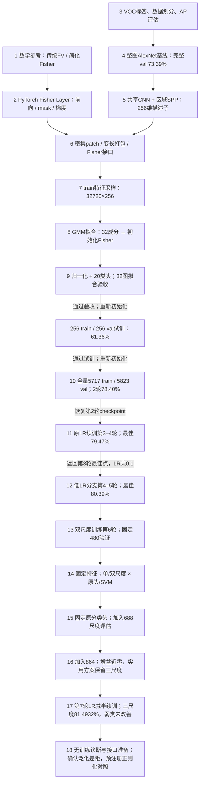

# 复现报告：三条主干

更新：2026-09-22。日常只需按顺序阅读以下三份报告：

1. [基础验证与CNN基线（步骤1–4）](01_foundations_and_backbone.md)：公式、数据/评估、整图基线73.39%完整val mAP。
2. [局部特征与GMM初始化（步骤5–8）](02_features_and_initialization.md)：SPP、密集patch、特征缓存、GMM、数据流程。
3. [联合训练与下一步（步骤9起）](03_joint_training.md)：训练至第7轮、三尺度复评、无训练弱类诊断和正则化接口准备；数值最佳val mAP81.4932%，下一项优先验证正则化。

**第7轮三尺度val mAP81.4932%，仅提高0.019个百分点；随后只读诊断显示该变化的配对重采样区间包含0，三弱类train–val AP差距约29–31点。** 新旧权重均保留；下一项计划从第6轮起点做一轮正则化单变量对照，尚未执行。整图基线和FisherNet的比较不是单因素消融。

## 项目路径图：我们如何走到这里

本路径图最初在第2轮后只读整理；现已补入第3–4轮续训进度。这里的“步骤10”指完整数据训练阶段，实际复用`step09_pilot.py`，没有新增同名训练脚本。



图中标记“重新初始化”的连线表示实验推进条件，**不是直接继承上一场小样本训练的权重**。每次试训/全量启动均重新使用固定CNN基线、第八步GMM和新分类头；本次第3–4轮明确使用resume，继承第2轮完整checkpoint。

### 每一步解决什么问题

| 步骤 | 为什么要做 | 输入 → 输出 | 验收结果 / 留下的能力 |
|---|---|---|---|
| 1 数学参考 | 避免还没弄清编码就在网络中调试 | 合成局部特征`[M,D]`、高斯参数`[K,D]` → FV`[2KD]` | 手算例子、分配归一化与排列不变性检查；建立独立NumPy参考 |
| 2 可微编码 | 确认以后能反向学习Fisher参数 | `[B,M,256]`+mask → `[B,16384]` | 6项测试及gradcheck；NumPy误差约2.22e-16 |
| 3 数据与评估 | 防止把标签或指标错误误认为模型问题 | VOC图片、20类标签 → 图片/target/valid；预测 → AP/mAP | 验证-1负类、0忽略、1正类；5项测试与数据抽查 |
| 4 CNN基线 | 先得到可复用的视觉特征和比较起点 | 整图`[B,3,224,224]` → 特征`[B,256]` → logits`[B,20]` | 先拟合、再续训和分辨率对照；默认完整val73.39%，320候选75.00% |
| 5 区域SPP | 把整图特征改成许多局部描述子 | 一次共享卷积 + 区域`[R,5]` → 池化`[R,256,6,6]` → `[R,256]` | 移除最后max-pool；池化、区域顺序、实图梯度与设备对照通过 |
| 6 自动组装 | 用自动区域替代手工ROI，处理不同图片patch数量 | 保比例图片列表 → 七尺寸网格 → `[B,Mmax,256]`+mask | 两图721/413个patch；归属、padding、分块和Fisher连通通过 |
| 7 真实分布采样 | 用CNN实际产生的特征准备GMM | train抽256张、每图最多128条 → 缓存`[32720,256]` | 保存ID/坐标/归属；有限值、方差与读回检查通过；不训练网络 |
| 8 初始化 | 给Fisher一个来自训练特征的起点 | 缓存 → GMM均值/标准差`[32,256]` → w/b | GMM60次EM收敛，数值对照误差约7.8e-16；不训练CNN |
| 9 学习验收 | 从“可计算”推进到“能分类、能学习” | 原始Fisher → 平滑power/L2 → 20类头 → masked BCE | 32图75步BCE0.033、F1=100%；重新初始化后256图试训两轮val子集61.36% |
| 10 完整训练 | 在完整划分建立FisherNet自己的成绩 | 5717张train更新全部模块；5823张val选模 | 第1/2轮mAP76.76%/78.40%；最佳/最后权重、预测和优化器状态保存 |

### 当前模型：前向数据与反向学习

```text
原图 → 训练随机480/576，验证480；保比例缩放、标准化 → 每图[3,H,W]
  ├─ 共享CNN → [1,256,Hf,Wf]
  └─ 七种区域尺寸64…256、步长32 → [Mi,5]
                 ↓ 区域6×6最大池化
        [Mi,256,6,6] → 展平9216 → fc6/fc7 → [Mi,256]
                 ↓ 按图片归属打包，只补描述子、不补图像像素
        [B,Mmax,256] + mask[B,Mmax]
                 ↓ Fisher一阶/二阶统计，K=32
              [B,2×32×256] = [B,16384]
                 ↓ 平滑power + L2 + Linear(16384,20)
                   logits[B,20]
                 ↓ 有效标签平均BCE（raw_label=0忽略）
          梯度反传：分类头 ← Fisher参数 ← fc层 ← CNN
```

GMM只用于生成**初始化参数**。联合训练后w/b已更新，不需要每个epoch重拟合GMM，也不能把第八步的GMM文件当成当前模型全部状态。恢复当前模型应加载完整checkpoint。

### 当前文件与产物路径

项目根目录：仓库根目录。

| 路径 | 当前职责 |
|---|---|
| `data/voc_classification.py`、`data/patch_inputs.py` | 标签/损失、整图或patch预处理、区域、变长batch |
| `models/alexnet_baseline.py`、`models/baseline_bundle.py` | 整图基线及来源校验/加载 |
| `models/spp_patch_encoder.py`、`models/dense_fisher_encoder.py` | 共享局部特征、变长打包与聚合 |
| `models/fisher_layer.py`、`models/fisher_classifier.py` | 可微编码、初始化、归一化和多标签头 |
| `metrics/voc_ap.py` | 逐类AP与mAP |
| `step01_fisher`、`step02/03/05/06/07/09_verify.py` | 对应阶段验证；step01文件无扩展名，斜杠编号表示各独立文件 |
| `step04_train/continue/targeted.py` | 整图基线训练/续训/分辨率对照，各为独立脚本 |
| `step04_diagnose/export/infer.py` | 整图诊断/导出/推理，各为独立脚本 |
| `step07_sample.py`、`step08_gmm.py` | 采样与GMM拟合 |
| `step09_train.py`、`step09_pilot.py` | 32图验收；子集/全量联合训练及续训 |
| `artifacts/alexnet_baseline_v1/` | 后续CNN的固定起点 |
| `runs/step07_sample_20260920_012954_361930/` | 原始patch采样缓存与统计 |
| `runs/step08_gmm_20260920_014414_978178/` | 初始GMM及验证 |
| `runs/step10_full_20260920_181950/` | 完整训练第1–2轮 |
| `runs/step10_full_20260920_234434/` | 第3–4轮续训，last.pt/预测/配置/历史；历史best位置见训练主报告 |

这些入口不是要求每天从第一步重跑。当前继续工作主要围绕`runs/step12_scale_20260921_130318/`及主报告指定的最佳权重；基础验证在相关模块修改后再按需回归。

## 目录约定

- 根目录：本索引和三份主报告；后续优先更新对应主干，避免每个小改动新增一份。
- `assets/`：报告附件；`archive/run_details/`：逐次运行详情。
- 逐轮日志、旧方案选择记录和早期报告仅保留在本地实验档案中；项目 `runs/` 和 `artifacts/` 保存原始实验与权重。

主报告只保留目标、关键配置、结论、限制、入口和证据位置。逐轮日志、完整逐类AP、排错细节、旧计划保留在归档或原始运行目录。
